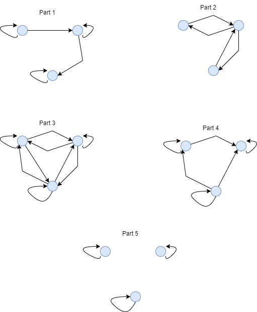

# CSE 280 Challenge Set 05 - Solutions

(c) BYU-Idaho

## Question 1

For each relation below, determine which property they satisfy.  Each relation has the domain of $\mathbf{R}$.  Remember to use a digraph if you need help.

|Relation|Reflexive or Anti-Reflexive|Symmetric or Anti-Symmetric|Transitive|Equivalence|
|:-:|:-:|:-:|:-:|:-:|
|$_aR_b, \text{ if } a^2 = b^2$|Reflexive|Symmetric|Yes|Yes|
|$_aR_b, \text{ if }\lfloor a \rfloor = b$|Neither|Anti-Symmetric|Yes|No|
|$_aR_b, \text{ if } a-b \ge 0$|Reflexive|Anti-Symmetric|Yes|No|
|$_aR_b, \text{ if } -a-b = 1$|Neither|Symmetric|No|No|
|$_aR_b, \text{ if } a-b = 5$|Anti-Reflexive|Anti-Symmetric|No|No|

## Question 2

Determine if each of the following relations are equivalences and why.  The domain for these relations is $\lbrace A, B, C, D \rbrace$? 

* $\lbrace (A,B), (B,A), (C,D), (D,C) \rbrace$
* $\lbrace (A,A), (B,B), (C,C), (D,D), (A,B), (B,A), (C,D), (D,C) \rbrace$
* $\lbrace (A,B), (B,C), (C,B), (B,A), (A,A), (B,B), (C,C), (D,D) \rbrace$
* $\lbrace (A,A), (B,B), (C,C), (D,D), (A,B), (B,C), (A,D), (A,C), (D,C) \rbrace$

Answer:

* No, Not reflexive or transitive
* Yes
* No, Not transitive
* No, Not symmetric

## Question 3

For the following parts, assume that the domain of each relation is $\lbrace A, B, C \rbrace$.  There may be more than one correct answer for each part.

### Part 1

Draw a digraph of a relation that satisfies only the reflexive property.

### Part 2

Draw a digraph of a relation that satisfies only the symmetric property.

### Part 3

Draw a digraph of a relation that is an equivalence.

### Part 4

Draw a digraph of a relation that satisifies both reflexive and transitive properties only.

### Part 5

Draw a digraph of a relation that is both an equivalance and anti-symmetric (this is not a trick question ... it is possible).

## Question 4

### Part 1

Define the relationship $_aR_b$ if $a$ and $b$ have the same remainder when divided by 5.  The domain of $a$ and $b$ is $\mathbf{Z}$.  Identify all of the equivalence classes and their contents. 

Answer:

* Remainder 0: $[0] = \lbrace 5x \mid x \in \mathbf{Z}\rbrace = \lbrace ..., -10, -5, 0, 5, 10, ... \rbrace$
* Remainder 1: $[1] = \lbrace 5x+1 \mid x \in \mathbf{Z}\rbrace = \lbrace ..., -9, -4, 1, 6, 11, ... \rbrace$
* Remainder 2: $[2] = \lbrace 5x+2 \mid x \in \mathbf{Z}\rbrace = \lbrace ..., -8, -3, 2, 7, 12, ... \rbrace$
* Remainder 3: $[3] = \lbrace 5x+3 \mid x \in \mathbf{Z}\rbrace = \lbrace ..., -7, -2, 3, 8, 13, ... \rbrace$
* Remainder 4: $[4] = \lbrace 5x+4 \mid x \in \mathbf{Z}\rbrace = \lbrace ..., -6, -1, 4, 9, 14, ... \rbrace$

### Part 2

Identify the equivalence classes for all of the equivalence relations from Question 1 above.

Answer:

$_aR_b, \text{ if } a^2 = b^2$
* $[0] = \lbrace 0 \rbrace$
* $[a] = \lbrace a, -a \rbrace$ where $a \in \mathbf{R}, a \ne 0$

