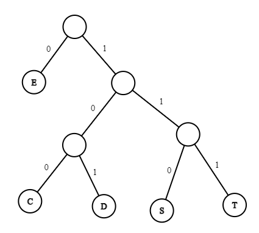
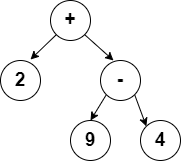
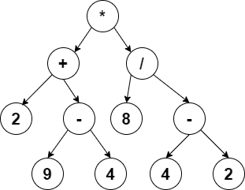
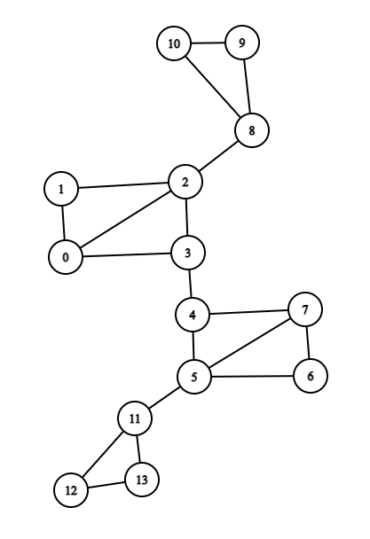

# CSE 280 Challenge Set 07 - Solutions

(c) BYU-Idaho

## Question 1

### Part 1

Consider the encoding tree below.  How would you encode `SEED`?  

Answer:

11000101

### Part 2

How many bits did you save with the encoding assuming letters take 8 bits?

Answer:

Save 24 bits

## Question 2

### Part 1

Create a binary tree that represents the following mathematical expression written using in-fix notation:

$(2 + (9 - 4)) * (8 / (4 - 2))$

Note that you only need to put numbers and operators in the tree.  Parentheses are not needed because they are implied by the parent/child relationship in the tree.
For example, the tree for the first two operations on the left hand side could be drawn as:

Verify that the forward in-order traversal of the tree matches the expression above (with the implied parentheses).

Answer: 

### Part 2

Determine the pre-order traversal of the tree you created in Part 1.  This is the pre-fix notation (or Polish Notation) of the expression.  Put spaces in between each number and operator.

Answer: * + 2 - 9 4 / 8 - 4 2

### Part 3

Determine the post-order traversal of the tree you created in Part 1.  This is the post-fix notation (or Reverse Polish Notation) of the expression.  Put spaces in between each number and operator.

Answer: 2 9 4 - + 8 4 2 - / *

### Part 4

Goto the website: https://www.rpn-calc.com/ and enter in your Reverse Polish Notation (spaces in between each number and operator) and verify the answer is correct (solve the expression in Part 1).  Why are parentheses not required?

Answer:  28.  The tree structure captures the parentheses.  

## Question 3

### Part 1

In the graph below, highlight or mark a spanning tree by using Depth First Search. Start at node 0.

Answer: Follow: 0, 1, 2, 3, 4, 5, 6, 7, go back to 5 and follow 11, 12, 13, go back to 2 and follow 8, 9, 10

### Part 2

In the same graph below, highlight or mark a spanning tree by using Breadth First Search.  Start at node 0.

Answer: Connect 0 with 1, 2, and 3; Connect 2 with 8; Connect 3 with 4; Connect 8 with 9 and 10; Connect 4 with 5 and 7; Connect 5 with 6 and 11; COnnect 11 with 12 and 13.

### Part 3

Compare how many verticies and edges are in both spanning trees.

Answer: They both have 14 verticies and 13 edges

### Part 4

Draw both spanning trees rooted at vertex 0. Compare the heights of the two trees.  Recall the root is at height 0.

Answer:
* BFS - Height of 5
* DFS - Height of 8

### Part 5

Suppose that each vertex in the graph has the ability to transmit (or forward) a message to all adjacent verticies.  If I wanted to transmit a message from vertex 0 to all the verticies in the original graph, should I create a spanning tree using BFS or DFS?  Why?  

Answer: BFS because it produces the shortest path from the starting vertex.

