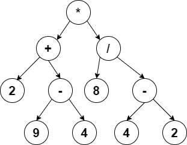

# CSE 280 Challenge Set 07 - Solutions

(c) BYU-Idaho

## Question 1

### Part 1

Consider the encoding tree below.  How would you encode `SEED`?  Note that we are defining left as 0 and right as 1.

Answer:

11000101

### Part 2

How many bits did you save with the encoding assuming letters take 8 bits?

Answer:

Save 24 bits

## Question 2

### Part 1

Create a binary tree that represents the following mathematical expression written using in-fix notation:

$(2 + (9 - 4)) * (8 / (4 - 2))$

Note that you only need to put numbers and operators in the tree.  Parentheses are not needed because they are implied by the parent/child relationship in the tree.
For example, the tree for the first two operations on the left hand side could be drawn as:

Verify that the forward in-order traversal of the tree matches the expression above (with the implied parentheses).

Answer: 

### Part 2

Determine the pre-order traversal of the tree you created in Part 1.  This is the pre-fix notation (or Polish Notation) of the expression.  Put spaces in between each number and operator.

Answer: * + 2 - 9 4 / 8 - 4 2

### Part 3

Determine the post-order traversal of the tree you created in Part 1.  This is the post-fix notation (or Reverse Polish Notation) of the expression.  Put spaces in between each number and operator.

Answer: 2 9 4 - + 8 4 2 - / *

### Part 4

Goto the website: https://www.rpn-calc.com/ and enter in your Reverse Polish Notation (spaces in between each number and operator) and verify the answer is correct (solve the expression in Part 1).  Why are parentheses not required?

Answer:  28.  The tree structure captures the parentheses.  

## Question 3

### Part 1

In the graph below, highlight or mark a spanning tree by using Depth First Search. Start at node 0.

Answer: Follow: 0, 1, 2, 3, 4, 5, 6, 7, go back to 5 and follow 11, 12, 13, go back to 2 and follow 8, 9, 10

### Part 2

In the same graph below, highlight or mark a spanning tree by using Breadth First Search.  Start at node 0.

Answer: Connect 0 with 1, 2, and 3; Connect 2 with 8; Connect 3 with 4; Connect 8 with 9 and 10; Connect 4 with 5 and 7; Connect 5 with 6 and 11; COnnect 11 with 12 and 13.

### Part 3

Draw both spanning trees rooted at vertex 0 next to the graphs above. Compare the heights of the two trees.  

Answer:
* BFS - Height of 5
* DFS - Height of 8

### Part 4

Suppose that each vertex in the graph has the ability to transmit (or forward) a message to all adjacent verticies.  If I wanted to transmit a message from vertex 0 to all the verticies in the original graph, should I create a spanning tree using BFS or DFS?  Why?  

Answer: Both will work but the BFS produces the shortest number of steps ("hops") to transmit to everyone.

## Question 4

Visit the following online maze solver: https://zyrridian.github.io/bfs-dfs-maze/

Answer the following questions:
* Generate new mazes (big or small) and solve them using BFS or DFS (or at the same time).  Set the speed slow enough so you can see the behavior of BFS and DFS. Note that the maze can be represented as a graph of allowable movements.  Which algorithm most commonly found the end of the maze the fastest?

Answer: BFS runs faster

* Which algorithm used the most computer memory?  

Answer: BFS must store all paths being followed which will increase as time progresses.  The DFS is only storing the one path it is following. When DFS backtracks, it removes the parts of the path that were previously remembered.  BFS uses more memory.

* Consider writing a solver for Soduku.  You would have 9 possible numbers (open paths in the maze) to put in each of the boxes not yet populated.  If a number choice leads to breaking a rule, then we can't move forward on that path (wall in the maze).  How might memory impact our decision of whether to use BFS or DFS?

Answer: With BFS, I must store the results of all possible paths.  In a blank Soduku board, that would be $9^{81}$ possible solutions (paths) to follow.  For DFS, it only store the 1 possible path at a time which would be $81$  We must use DFS for Soduku.
