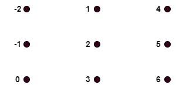
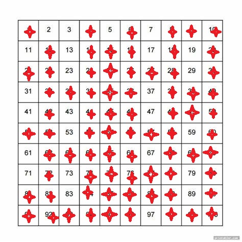

# CSE 280 Challenge Set 10 - Solutions

(c) BYU-Idaho

## Question 1

Solve for $n$ in the following:

* $n \text{ div } 7 = 5 \text{ , } n \text{ mod } 7 = 1$
* $n \text{ div } 6 = -6 \text{ , } n \text{ mod } 6 = 2$
* $n \text{ div } 5 = 7 \text{ , } n \text{ mod } 5 = 3$

Answer:

* $7*5 + 1 = 36$
* $-6*6+2 = -34$
* $5*7 +3 = 38$

Note, for $n \text{ div } m = p \text{ , } n \text{ mod } m = q$ that $n = m \cdot p + q$ where $p$ is the quotient (integer division) and $q$ is the remainder.

## Question 2

For the values of ($x,y)$ below, determine if $x \equiv y(\text{mod } 11)$:

* $(37,12)$
* $(52,19)$
* $(131,10)$
* $(14,13)$

Answer:

* No 
* Yes
* Yes 
* No 

To check congruence with $(\text{mod }11)$, evaluate: $11 \mid (x-y)$

## Question 3

Find the GCD and LCM for the following values that are represented with non-decreasing prime factorization.  Write you answers using non-decreasing prime factorization as well.

|$x$|$y$|GCD|LCM|
|:-:|:-:|:-:|:-:|
|$2^4 \sdot 5^2$|$2^3 \sdot 3^2$|$2^3 = 8$|$2^4 \sdot 5^2 \sdot 3^2 = 3600$|
|$7^3 \sdot 13^2$|$2^5 \sdot 11 \sdot 13^3$|$13^2 = 169$|$7^3 \sdot 13^3 \sdot 2^5 \sdot 11 = 265256992$|
|$2^4 \sdot 3^2 \sdot 5 \sdot 7^2$|$3^2 \sdot 7^2$|$3^2 \sdot 7^2 = 441$|$2^4 \sdot 3^2 \sdot 5 \sdot 7^2 = 35280$|

## Question 4

Find the numbers in the set $S = \lbrace -23, -13, -4, 4, 13, 23, 8, 15, 46 \rbrace$ that are part of the equivalence relation $\text{Z}_4$.  In other words, find the numbers from $S$ that are congruent $(\text{mod } 4)$ and put them into the appropriate equivalence classes.    

Answer:

|Equivalence Class|Set|
|:-:|:-:|
|$[0]$|$\lbrace -4, 4, 8 \rbrace$|
|$[1]$|$\lbrace -23, 13 \rbrace$|
|$[2]$|$\lbrace 46 \rbrace$|
|$[3]$|$\lbrace -13, 23, 15 \rbrace$|

Note for doing floor with negative numbers, that $\lfloor \frac{-23}{4} \rfloor = \lfloor -5.75 \rfloor = -6$ 

## Question 5

Consider the following relation: 

$_xR_y \text{ if } x \equiv y \ (\text{mod } 3)$

Complete the di-graph below to demonstrate that congruence is an equivalence relation.  The domain of the relationship is $\mathbf{Z}$ but the graph only includes a subset of these values.

  

  

## Question 6

Use the following process with the table below:

1. Cross out the box with 1.
2. Goto the box with 2.
3. Let $n$ equal the box you are on.  Cross out all boxes that are multiples of $n$ starting with $n^2$.
4. Goto the smallest box greater than $n$ that is not crossed out and go back to step three.  If there are no more available numbers then stop.

Consider the numbers that are not crossed out.  What do they represent?

Answer: The prime numbers less than or equal to 100.  This is called the Sieve of Eratosthenes.