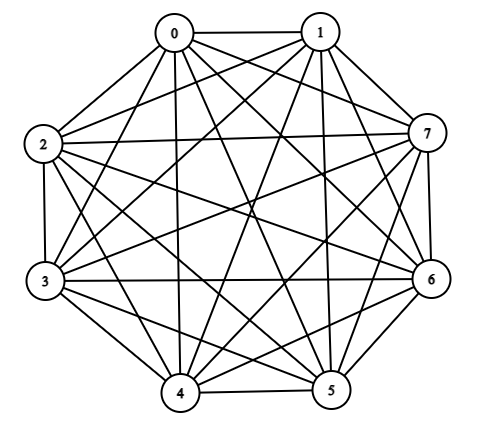
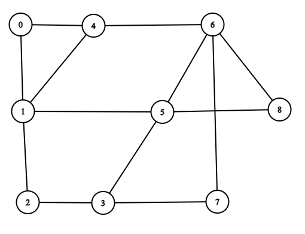
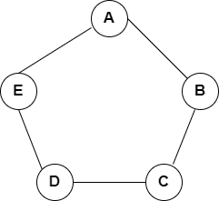
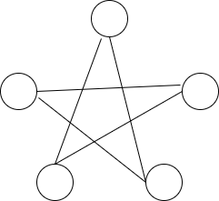
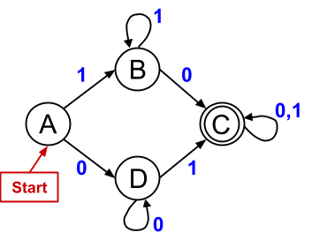

# CSE 280 Challenge Set 06

(c) BYU-Idaho

## Question 1

Consider the $K_8$ graph below.  

### Part 1

Find the following: 

* total edges
* total vertices
* degree of each vertex
* total degree of the graph

### Part 2

What is the relationship between the number of edges and the total degree?

### Part 3

Does the graph above have an Euler circuit?  How do you know?

## Question 2

The following graph does not have an Euler circuit.  How can you add 1 new edge to ensure there is a Euler circuit?

## Question 3

Consider the following two graphs.  If these graphs are isomorphic, then fill in the missing letters A through E.

|Graph 1|Graph 2
|:-:|:-:|
|||

    

## Question 4

Consider the Finite State Machine (FSM) below.

**Part 1**

* What is the final state with input 100011?  Is the input accepted?
* What is the final state with input 0000? Is the input accepted?
* What is the final state with input 1100? Is the input accepted?

**Part 2**

What type of input stream does the FSM look for?

## Question 5

**Part 1**

Draw an FSM to determine if a string of only A's and B's has the substring "ABAB" within it.  Test the FSM with:

* AABABB - Match
* ABAABAB - Match
* ABBABAABABAAA - Match

          

**Part 2**

Draw an FSM to determine how many times the substring "ABAB" exists within the string.  Recall that you do this by counting how many times you arrive at the acceptance state.  Test the FSM with:

* ABABABAB - 3 times
* ABAABABABB - 2 times

